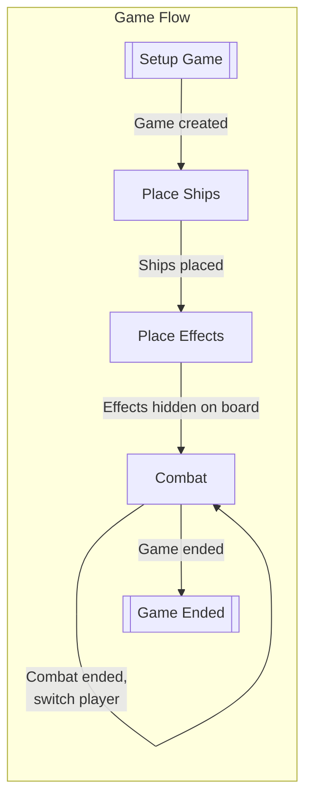
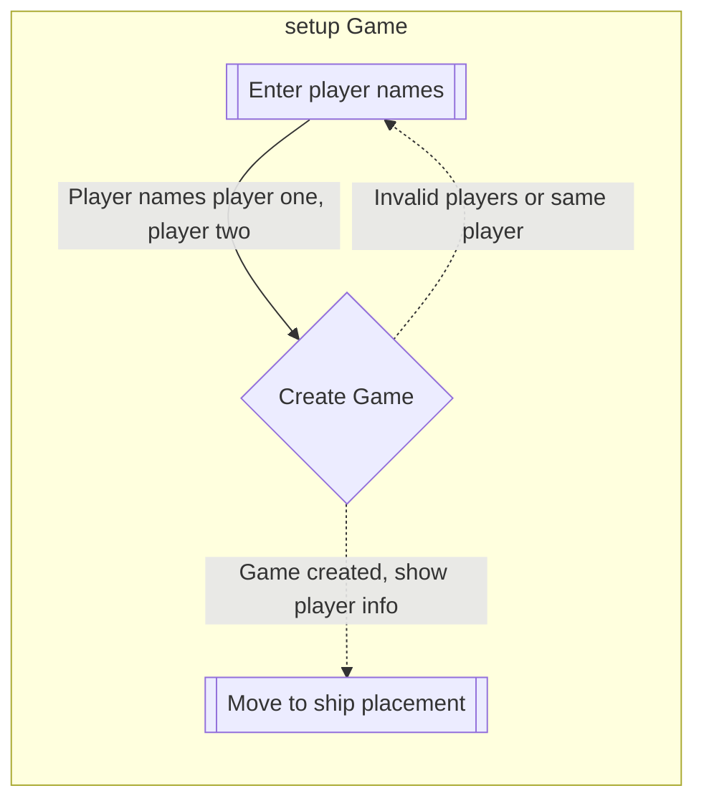
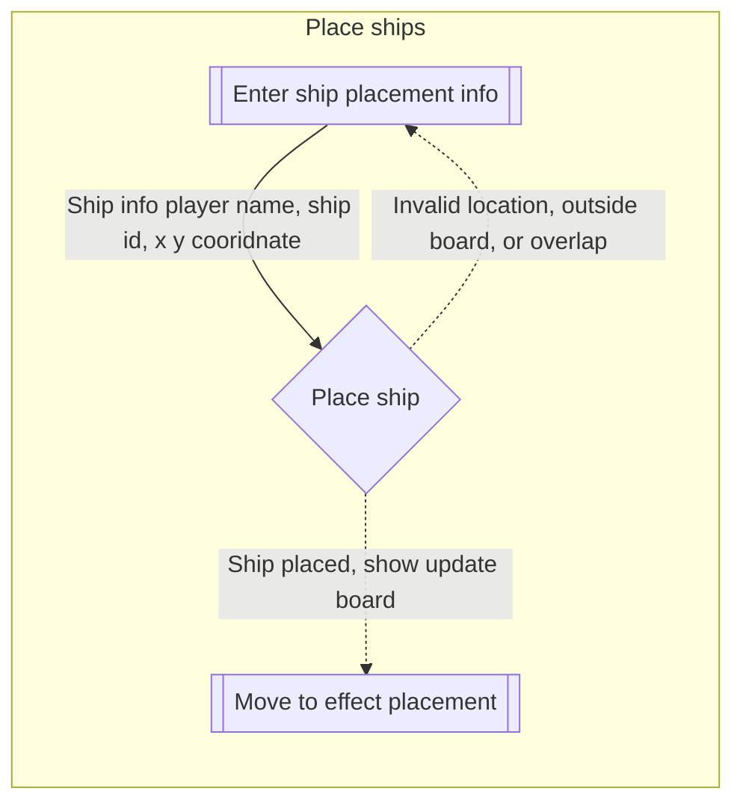
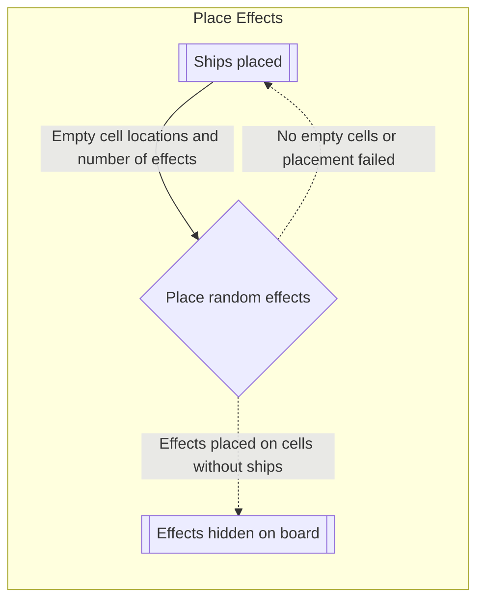
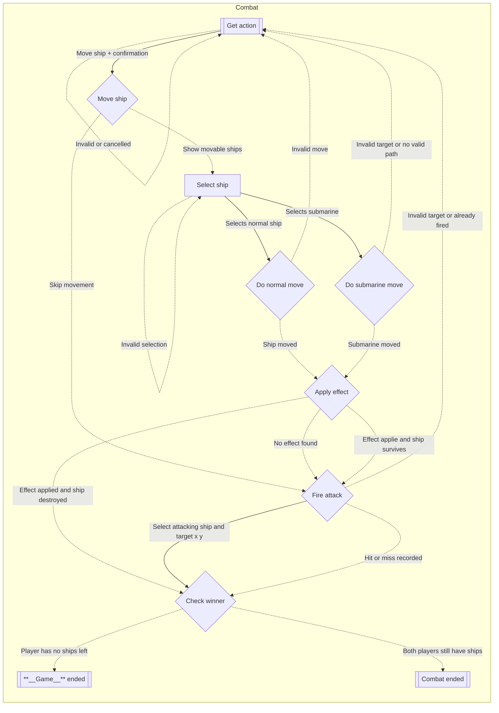
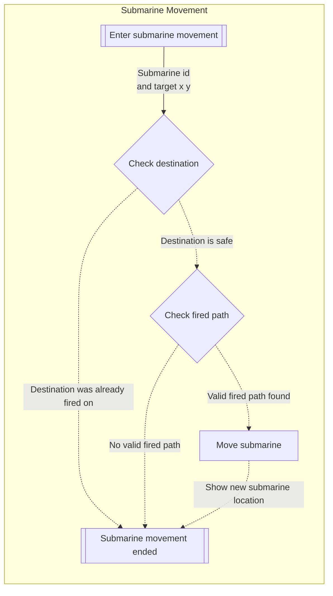
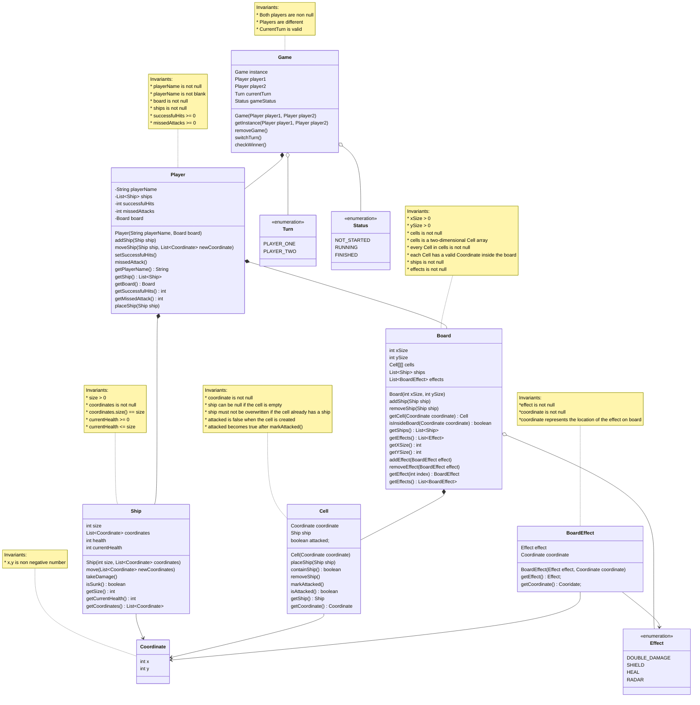

# 2450 - Battleship++

**Author: Thien Tang**

**Course: COMP 2450**

**Term: Summer 2026**

# Overview

This project begins with a domain model design for the classic [Battleship] game. Battleship is a two-player strategy game where each player secretly places ships on their own grid. Players then take turns attacking coordinates on the opponent’s grid in order to find and sink all of the opponent’s ships.

The purpose of this phase is to create an abstract design of the game before implementation. The design identifies the main objects in the system, the relationships between those objects, and the rules that describe valid states in the game. This includes players, boards, ships, cells, coordinates, and attacks.

This model represents the basic version of Battleship first. It can later be expanded to include new Battleship++ features such as variable board sizes, movable ships, and special effects.

The purpose of Phase 2 is to implement the domain model from Phase 1 and update the model so that it accurately reflects the Java implementation. The project also includes a command-line REPL so that the model can be tested by creating, reading , updating, and deleting objects during runtime.

[Battleship]: https://en.wikipedia.org/wiki/Battleship_(game)

## Flows of Interaction

### Diagrams

#### Overall Flow

This diagram is showing general of how the game is played, each sub-task here will show the specific of work.

#### Setup Game

#### Place ships

#### Place Effect

#### Combat

#### Submarine Movement 

## REPL

### Building and Running the REPL

The project has been built and tested to be run in IntelliJ IDEA and Maven.

To run this project in IntelliJ: Open the main entry point file: `src/main/java/comp2450/REPL`

and then run the main method in `REPL`.

## Commands

### The REPL supports the following commands:
* `HELP` — Shows all available commands and input formats.
* `ADD PLAYER` — Adds a new player by name.
* `ADD GAME` — Creates a new game using two existing players.
* `SELECT BOARD` — Selects the current board by player name.
* `ADD SHIP` — Adds a ship to the selected board.
* `ADD EFFECT` — Adds an effect to the selected board.
* `SHOW GAME` — Displays both boards and player information.
* `SHOW SHIPS` — Displays all ships in the current game.
* `SHOW EFFECTS` — Displays all effects in the current game.
* `MOVE SHIP` — Moves a selected ship to new coordinates.
* `REMOVE SHIP` — Removes a selected ship.
* `REMOVE EFFECT` — Removes a selected effect.
* `REMOVE GAME` — Deletes the current game.
* `EXIT` — Exits the REPL.

## Changes

During implementation, I have made several changes to the original domain model in Phase 1

* Renamed `Map` to `Board` because Java already has a built-in `Map` interface, so I used `Board` to avoid with the built-in and better represents the Battleship game area.
* Changed abstract types such as `Name`, `WholeNumber`, and `PositiveNumber` into concrete Java types such as `String` and `int`.
* Changed `Cell cells` into `Cell[][] cells` because the board is implemented as a two-dimensional grid.
* Changed `Status attackStatus` in `Cell` into `boolean attacked` because cell attack state only needs to represent attacked or not attacked.
* Added REPL, input, and output classes to separate user interaction from the domain model.
* Used Guava `Preconditions` to enforce invariants in constructors and methods.
* Added a unique game design using the `Game` singleton pattern because only one game exists in the system at a time.
* Added REPL-related classes to handle user input and output separately from the domain model.
* Update domain model to show concrete Java types and relationships that match the implementation.

## Domain Model

The classic Battleship game contains two players. Each player has their own board and a collection of ships. A board is made up of cells, and each cell represents one coordinate on the grid. A ship occupies one or more cells on a player’s board. During the game, players make attacks by choosing coordinates on the opponent’s board.

An attack can result in a hit if the chosen coordinate contains part of a ship, or a miss if the coordinate is empty. A ship is sunk when all of its occupied cells have been hit. The game ends when one player has sunk all of the opponent’s ships.

The initial version of the model is as follows:

