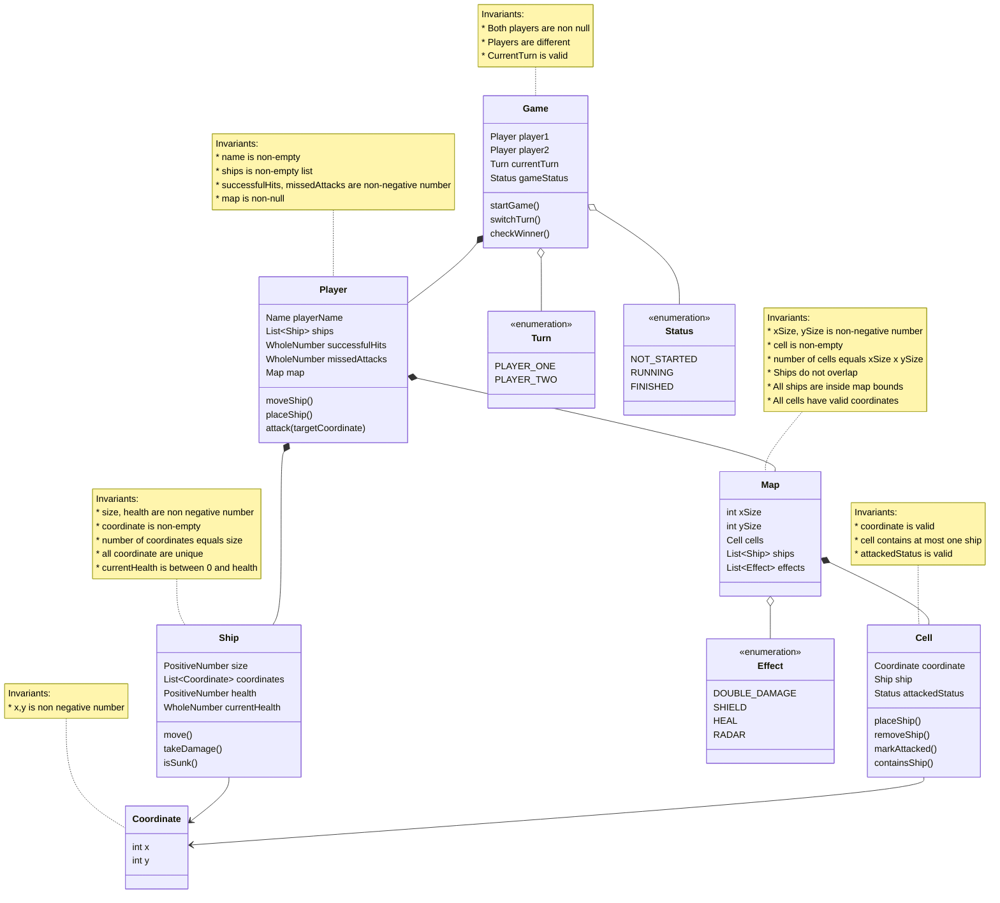

# 2450 - Battleship++

**Author: Thien Tang**

**Course: COMP 2450**

**Term: Summer 2026**

# Overview

This project begins with a domain model design for the classic [Battleship] game. Battleship is a two-player strategy game where each player secretly places ships on their own grid. Players then take turns attacking coordinates on the opponent’s grid in order to find and sink all of the opponent’s ships.

The purpose of this phase is to create an abstract design of the game before implementation. The design identifies the main objects in the system, the relationships between those objects, and the rules that describe valid states in the game. This includes players, boards, ships, cells, coordinates, and attacks.

This model represents the basic version of Battleship first. It can later be expanded to include new Battleship++ features such as variable board sizes, movable ships, and special effects.

[Battleship]: https://en.wikipedia.org/wiki/Battleship_(game)

## REPL

### Building and Running the REPL

The project has been built and tested to be run in IntelliJ. Open the project there, open "comp2450" folder, then the 
## Domain Model

The classic Battleship game contains two players. Each player has their own board and a collection of ships. A board is made up of cells, and each cell represents one coordinate on the grid. A ship occupies one or more cells on a player’s board. During the game, players make attacks by choosing coordinates on the opponent’s board.

An attack can result in a hit if the chosen coordinate contains part of a ship, or a miss if the coordinate is empty. A ship is sunk when all of its occupied cells have been hit. The game ends when one player has sunk all of the opponent’s ships.

The initial version of the model is as follows:

